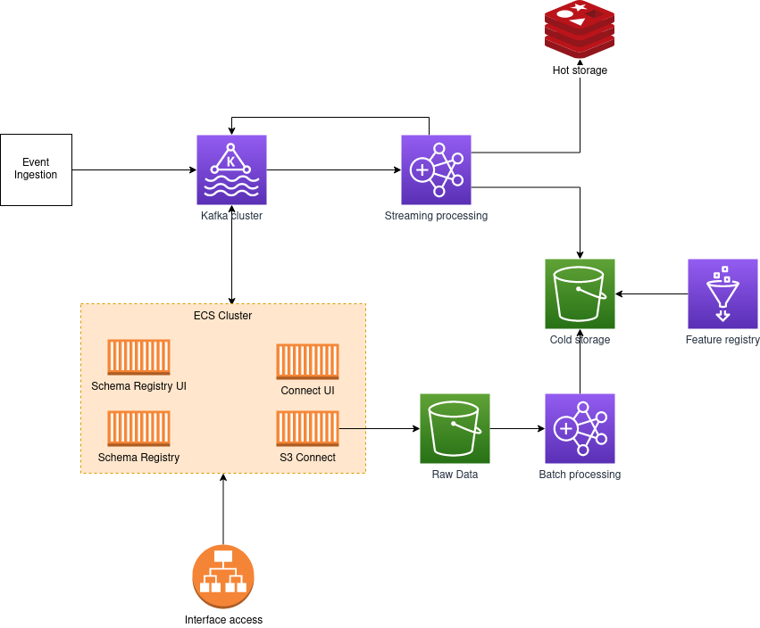

# ifood-fs-exercise

## Exercise bonus 01
Password: 1F00d{P13c3_0f_C4k3}

## Terraform

- An ECS Cluster with:
    - s3-connect container
    - connect-ui container
    - schema-registry container
    - schema-registry-ui container
    - kafka-rest-api Container
    - fs-ecs-producer
- An ALB
- A cloudwatch log group
- A Dynamodb table
- A Redis instance
- An EMR cluster
- A MSK Cluster
- A Security Group
- An VPC with subnets
- An Internet gateway
- A DNS Record
- A S3 Bucket 
- An IAM policy documet
- An IAM Role 

## Arquitetura

